# Hướng dẫn triển khai TTS Studio lên Coolify self-host (qua Cloudflare Tunnel)

Tài liệu ghi lại **toàn bộ quá trình đã thực hiện thành công** khi đưa dự án `TTS_ClaudeCode` (Next.js Edge TTS Studio + VieNeu-TTS) lên máy chủ Coolify tự quản, công khai qua `https://tts.vtcdigital.top`. Mỗi bước có hình minh họa chụp từ lần triển khai thật, kèm danh sách lỗi đã gặp và cách sửa.

> **Quy ước:** các giá trị dưới đây là của lần triển khai này. Khi làm lại, thay bằng giá trị của bạn: tên miền `tts.vtcdigital.top`, repo `github.com/canona/TTS_ClaudeCode`, mã ứng dụng Coolify `j26u9jryuouxl7aydzjnwx3c`. Mật khẩu và API key trong tài liệu chỉ là **chỗ giữ chỗ** (`<...>`), không ghi giá trị thật.

## Mục lục

1. Tổng quan và kiến trúc
2. Yêu cầu chuẩn bị
3. Bước 1: Đưa mã nguồn lên Git
4. Bước 2: Khai báo Cloudflare (DNS và Tunnel)
5. Bước 3: Tạo ứng dụng trong Coolify
6. Bước 4: Khai báo tên miền trong Coolify
7. Bước 5: Biến môi trường
8. Bước 6: Deploy và theo dõi
9. Bước 7: Kiểm tra dịch vụ
10. Lỗi đã gặp và cách khắc phục
11. Vận hành sau triển khai
12. Phụ lục: lệnh hữu ích, bảng biến môi trường, API

---

## 1. Tổng quan và kiến trúc

Dự án gồm hai container chạy bằng file `docker-compose.coolify.yml`:

| Service | Vai trò | Cổng nội bộ |
|---|---|---|
| `tts` | Ứng dụng Next.js (giao diện web + API `/api/v1`), dùng giọng Microsoft Edge | 3102 |
| `vieneu` | VieNeu-TTS (ONNX, CPU), giọng tiếng Việt offline, `tts` gọi qua `http://vieneu:8000` | 8000 (chỉ nội bộ) |

Luồng truy cập từ Internet:

```
Người dùng
   │ HTTPS
   ▼
Cloudflare (Proxied)
   │ Tunnel "office-server"
   ▼
cloudflared trên máy chủ
   │ http://localhost:80
   ▼
Traefik (coolify-proxy)
   │ định tuyến theo Host header
   ├──▶ container tts :3102
   └──▶ container vieneu :8000 (nội bộ, tts gọi)
```

Điểm then chốt của mô hình này:

- **HTTPS do Cloudflare đảm nhiệm**, nên trong Coolify domain dùng giao thức `http`, không xin Let's Encrypt.
- Tunnel không trỏ thẳng vào cổng 3102 mà trỏ vào **Traefik cổng 80**; Traefik định tuyến theo tên miền sang đúng container.
- Máy chủ trong trường hợp này là **Windows 11 chạy Docker trong WSL2** (Xeon E5-2640 v2, 12 GB RAM). Coolify, Traefik và các container đều nằm trong WSL.

## 2. Yêu cầu chuẩn bị

| Hạng mục | Yêu cầu |
|---|---|
| Máy chủ | Đã cài Coolify (phiên bản trong ảnh: v4.3.23), Docker hoạt động, tối thiểu 4 GB RAM trống, đề xuất 8 GB trở lên |
| Cổng 80 trên máy chủ | Do `coolify-proxy` (Traefik) chiếm; không có phần mềm khác dùng cổng này |
| Cloudflare | Tên miền đã quản lý trên Cloudflare, đã có Tunnel đang chạy (ở đây là `office-server`) |
| Git | Tài khoản GitHub, Git cài sẵn trên máy làm việc |
| Kết nối mạng | Máy chủ truy cập được `github.com`, `huggingface.co`, Docker Hub |

Kiểm tra nhanh Traefik có nghe cổng 80 (chạy trong WSL/Linux của máy chủ):

```bash
docker ps --format '{{.Names}}\t{{.Ports}}' | grep -i proxy
```

Kết quả mong đợi có `0.0.0.0:80->80/tcp` ở dòng `coolify-proxy`.

---

## 3. Bước 1: Đưa mã nguồn lên Git

Repo cần chứa các file triển khai sau (đã có sẵn trong dự án):

| File | Mục đích |
|---|---|
| `Dockerfile` | Build đa tầng, chạy Next.js ở chế độ `standalone`, cổng 3102, có HEALTHCHECK `/api/health` |
| `docker-compose.coolify.yml` | Định nghĩa 2 service `tts` và `vieneu`, các volume lưu dữ liệu, không khai báo `ports:` (Traefik định tuyến) |
| `.env.example` | Danh sách biến môi trường mẫu (không chứa bí mật) |
| `.dockerignore`, `.gitignore` | Loại `node_modules`, `.next`, `.env*`, dữ liệu runtime |

**Không** commit file `.env`, mật khẩu, API key. `.gitignore` đã loại `.env`, `.clients/`, `.usage/`, `.voices/`.

### 3.1. Commit

```powershell
cd D:\ThucHanhAI\TTS_ClaudeCode
git status
git add -A
git commit -m "Initial commit: Edge TTS Studio + Coolify deployment"
```

Commit dùng trong lần triển khai này là `5f91ea4` (nhánh `main`).

### 3.2. Tạo repo và push

1. Trên GitHub tạo repo mới (ở đây là `canona/TTS_ClaudeCode`). Để **Public** thì Coolify clone được không cần khóa; nếu **Private** xem mục 5.3.
2. Gắn remote và đẩy mã:

```powershell
git remote add origin https://github.com/canona/TTS_ClaudeCode.git
git branch -M main
git push -u origin main
```

3. Mở `https://github.com/canona/TTS_ClaudeCode` kiểm tra thấy đủ file, đặc biệt `docker-compose.coolify.yml` ở thư mục gốc.

> **Lưu ý:** Coolify chỉ build được những gì đã `git push`. Sửa file cục bộ mà chưa push thì deploy sẽ không thấy thay đổi.

---

## 4. Bước 2: Khai báo Cloudflare (DNS và Tunnel)

### 4.1. Bản ghi DNS

Trong Cloudflare → tên miền `vtcdigital.top` → **DNS → Records**, có bản ghi:

| Name | Type | Target | Proxy |
|---|---|---|---|
| `tts` | CNAME | `<tunnel-id>.cfargotunnel.com` | Proxied (đám mây cam) |

Bản ghi này thường được **tạo tự động** khi bạn thêm Public Hostname cho tunnel (bước 4.2), hiển thị loại `Tunnel`, trỏ về tunnel `office-server`.


### 4.2. Public Hostname của Tunnel

Vào **Zero Trust → Networks → Tunnels → office-server → Routes**. Mỗi dòng ánh xạ một tên miền tới một dịch vụ trên máy chủ.

Ảnh dưới là danh sách route của tunnel. Các dịch vụ cũ (`colifyserver` → `localhost:8000`, `9router` → `localhost:20128`...) trỏ thẳng vào cổng riêng của từng ứng dụng. Dòng 8 `tts.vtcdigital.top` lúc này đang trỏ `localhost:8102`, **là giá trị chưa đúng** và sẽ được sửa ngay bên dưới.

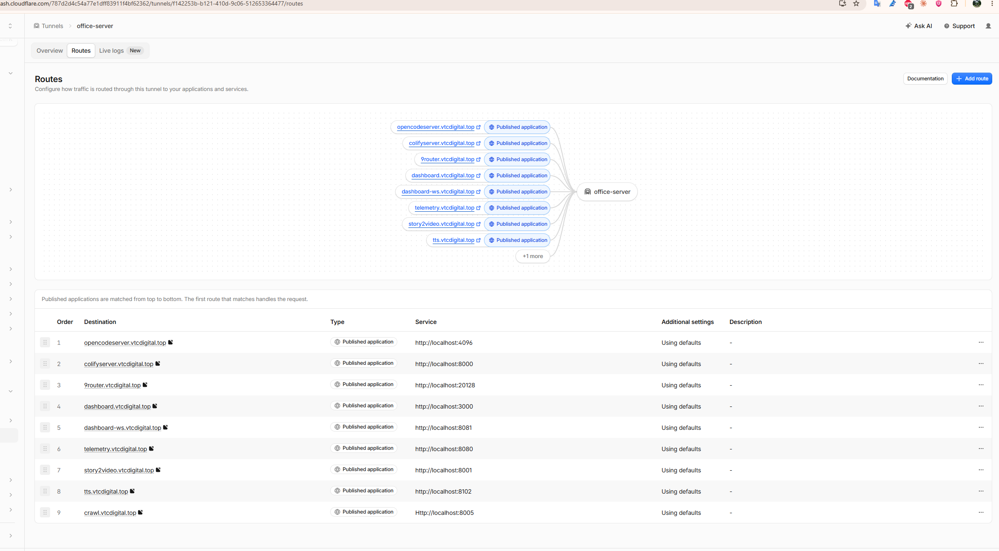

Bấm **Edit** ở dòng `tts.vtcdigital.top` và đặt:

| Trường | Giá trị |
|---|---|
| Subdomain | `tts` |
| Domain | `vtcdigital.top` |
| Path | để trống |
| **Service URL** | **`http://localhost:80`** (Traefik của Coolify) |

Bấm **Save changes**.

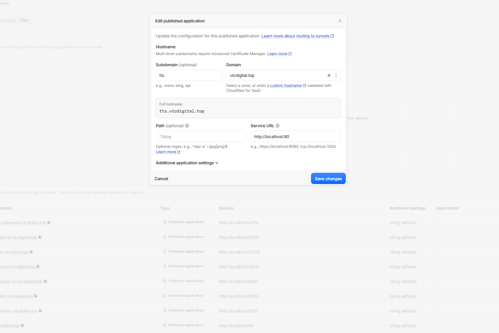

**Vì sao `localhost:80` mà không phải `localhost:3102`?**

- Trong `docker-compose.coolify.yml`, service `tts` dùng `expose: "3102"` (chỉ mở trong mạng Docker) chứ không `ports:`. Vì vậy cổng 3102 **không tồn tại trên máy chủ**; trỏ tunnel vào `localhost:3102` hoặc `localhost:8102` sẽ lỗi 502/1033.
- Trỏ về Traefik (cổng 80) cho phép Coolify tự định tuyến theo tên miền, đúng thiết kế của file compose và không phải sửa mã.

> Phương án thay thế khi Traefik không nghe cổng 80: thêm `ports: ["127.0.0.1:3102:3102"]` cho service `tts` trong `docker-compose.coolify.yml`, push lại, rồi để Service URL là `http://localhost:3102` (khi đó không cần khai báo domain trong Coolify).

---

## 5. Bước 3: Tạo ứng dụng trong Coolify

### 5.1. Chọn loại nguồn

Trong Coolify: **Projects → (project) → production → + New Resource**. Màn hình "Choose a resource" liệt kê các thẻ.

- Repo **Public**: chọn **Public Git Repository** → **Deploy**.
- Repo **Private**: chọn **Private Git Repository (with Deploy Key)** hoặc **Git Repository (with GitHub App)**.
- **Không** chọn thẻ *Docker Compose* ("without a Git repository") vì thẻ này không build từ mã nguồn của bạn.

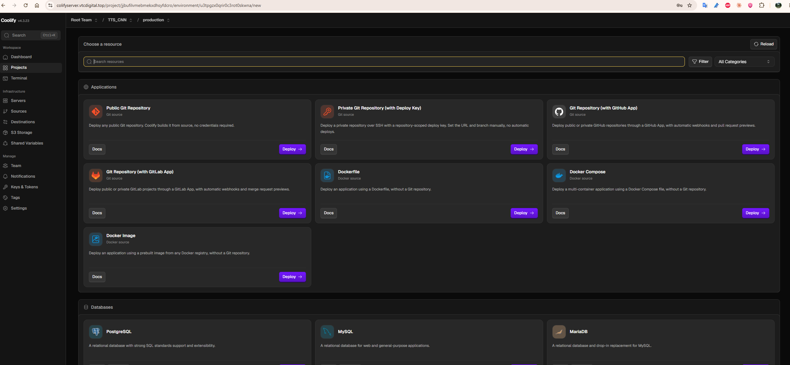

Chọn Server (`localhost`) và Destination mặc định, bấm **Continue**.

### 5.2. Nhập thông tin repo và đổi Build pack

Nhập **Repository URL** `https://github.com/canona/TTS_ClaudeCode`. Nhánh `main` tự nhận. Lưu ý **Build pack mặc định là Railpack** (hoặc Nixpacks), **bắt buộc đổi** vì dự án có sẵn `docker-compose.coolify.yml`.

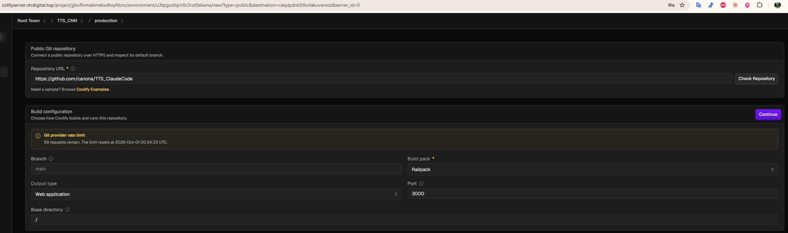

Đổi **Build pack** thành **Docker Compose**. Các ô *Output type* và *Port* sẽ biến mất, thay bằng *Compose file*. Cấu hình đúng:

| Trường | Giá trị |
|---|---|
| Repository URL | `https://github.com/canona/TTS_ClaudeCode` |
| Branch | `main` |
| Build pack | **Docker Compose** |
| Base directory | `/` |
| Compose file | `/docker-compose.coolify.yml` |

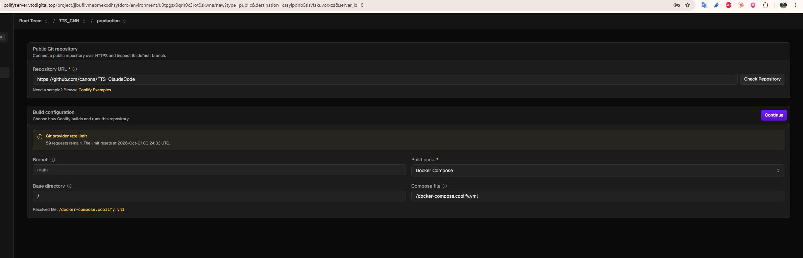

Bấm **Continue**. Cảnh báo *Git provider rate limit* chỉ là thông tin, bỏ qua.

### 5.3. Repo Private (không dùng ở lần này)

1. **Keys & Tokens → Private Keys → Add → Generate new ED25519**, lưu và sao chép Public Key.
2. GitHub → repo → **Settings → Deploy keys → Add deploy key**, dán khóa, để chế độ chỉ đọc.
3. Trong Coolify chọn khóa đó và dùng URL dạng SSH `git@github.com:<user>/<repo>.git`.

### 5.4. Nạp file compose

Sau khi tạo, vào trang cấu hình ứng dụng, mục **Build pipeline**: ô *Docker compose content (raw)* **đang trống**, thanh trên cùng báo "Load a Compose file to deploy".

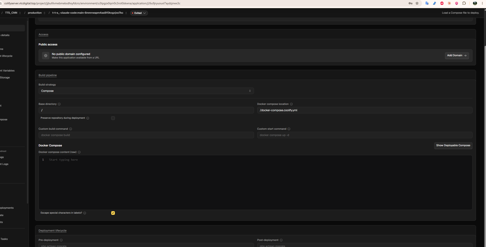

Bấm nút **Reload Compose File** (đầu trang). Nội dung `docker-compose.coolify.yml` hiện ra, hai service `tts` và `vieneu` được nhận diện. Nếu báo không tìm thấy file, kiểm tra lại *Docker compose location* rồi **Save** và Reload lần nữa.

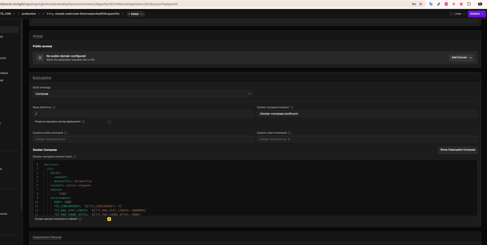

---

## 6. Bước 4: Khai báo tên miền trong Coolify

Ở khối **Access → Public access** bấm **Add Domain**. Hộp thoại ban đầu:

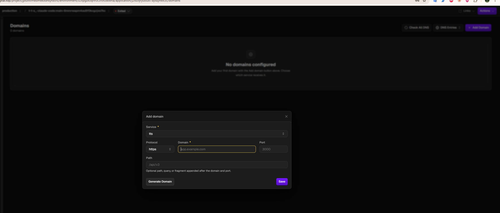

Điền như sau (vì HTTPS do Cloudflare lo nên chọn `http`):

| Trường | Giá trị | Ghi chú |
|---|---|---|
| Service | `tts` | Không đặt domain cho `vieneu` |
| Protocol | **`http`** | Để `https` Traefik sẽ xin Let's Encrypt, dễ lỗi/redirect loop sau Cloudflare |
| Domain | `tts.vtcdigital.top` | Chỉ tên miền, không kèm `https://` hay cổng |
| Port | **`3102`** | Mặc định hiện 3000, **phải đổi** |
| Path | để trống | |

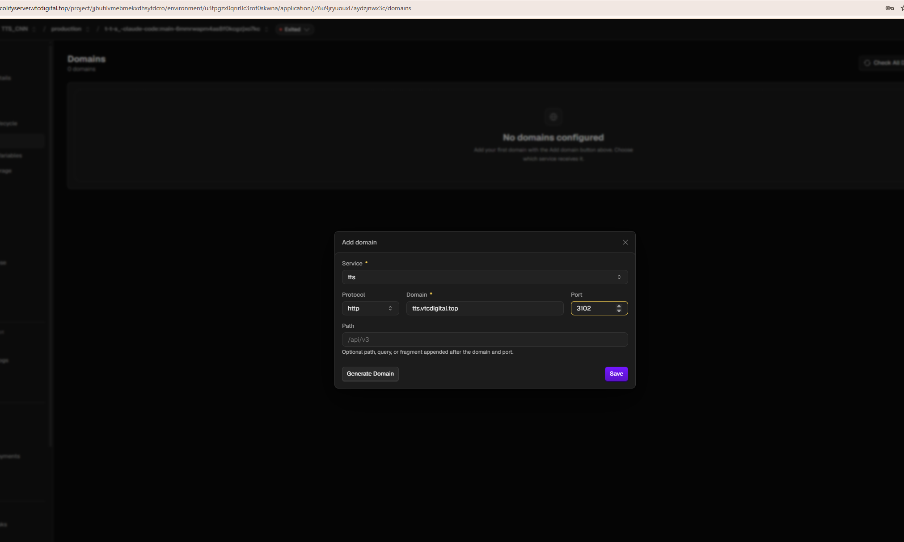

Bấm **Save**. Coolify hiển thị 2 tên miền: `http://tts.vtcdigital.top` và `http://www.tts.vtcdigital.top` (tự thêm biến thể `www`). Domain `www.` không có DNS nên vô hại, có thể xóa bằng biểu tượng thùng rác.

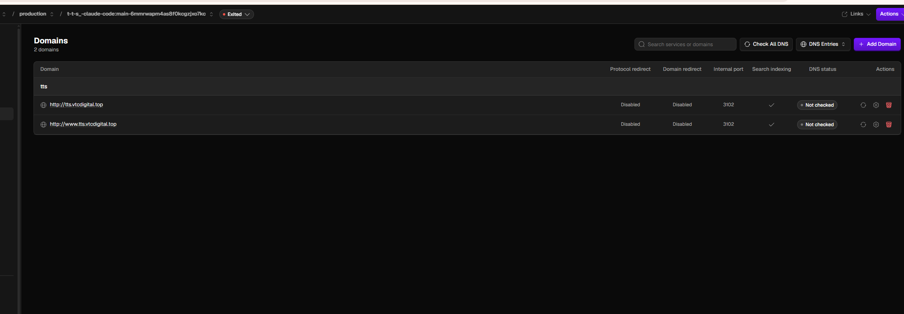

---

## 7. Bước 5: Biến môi trường

Menu trái → **Environment Variables**. Coolify tự đọc các biến `${...}` trong file compose và tạo sẵn, mỗi biến có hai dòng: **Production** (dùng khi deploy) và **Preview** (cho PR preview, bỏ qua).

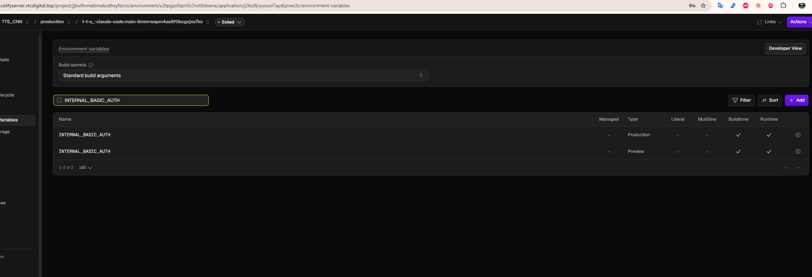

Bấm biểu tượng bánh răng ở dòng **Production** để đặt giá trị cho **hai biến bắt buộc**:

| Biến | Giá trị | Mục đích |
|---|---|---|
| `INTERNAL_BASIC_AUTH` | `admin:<mật-khẩu-mạnh>` | Khóa giao diện web nội bộ bằng HTTP Basic Auth. `/api/v1/*` và `/api/health` **không** bị khóa |
| `VIENEU_API_KEY` | chuỗi ngẫu nhiên, ví dụ `openssl rand -hex 24` | Khóa dùng chung giữa `tts` và `vieneu` |

Lưu ý khi nhập:

1. Ô **Comment** có thể bị trình duyệt tự điền email; xóa trống.
2. `INTERNAL_BASIC_AUTH` phải đúng dạng `user:password` (có dấu `:`). Nếu mật khẩu chứa `$`, đổi *Interpolation* sang Literal.
3. Bấm **Update Variable** cho từng biến.
4. Các biến còn lại (`TTS_CONCURRENCY`, `CACHE_*`, `V1_MAX_CONCURRENT`...) để trống vì compose đã có giá trị mặc định.

Sinh khóa ngẫu nhiên nhanh:

```bash
openssl rand -hex 24
# hoặc dùng Node.js
node -e "console.log(require('crypto').randomBytes(24).toString('hex'))"
```

> Mật khẩu `INTERNAL_BASIC_AUTH` đặt tạm cho lần đầu phải **đổi lại** sau khi triển khai nếu đã bị lộ (xem mục 11).

---

## 8. Bước 6: Deploy và theo dõi

1. Bấm **Actions → Deploy**.
2. Menu trái → **Deployments** → mở deployment đang chạy để xem log.

Log lúc đầu (đoạn này là bình thường):

```
Importing canona/TTS_ClaudeCode:main (commit sha 5f91ea4d...) to /artifacts/...
Added 39 ARG declarations to Dockerfile for service tts (multi-stage build, added to 3 stages).
Dockerfile not found for service vieneu at https://github.com/pnnbao97/VieNeu-TTS.git#..., skipping ARG injection.
Pulling & building required images.
Adding build arguments to Docker Compose build command.
```

Dòng "Dockerfile not found for service vieneu ... skipping ARG injection" **chỉ là thông báo**: Coolify không đọc được Dockerfile ở URL Git từ xa của `vieneu`.

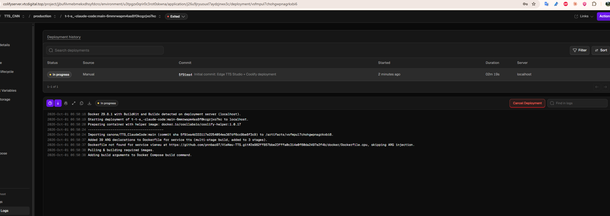

**Thời gian thực tế:** lần deploy đầu mất khoảng **24 phút 25 giây** (06:50:38 → 07:15:03) vì phải kéo image và build `vieneu`. Log trên giao diện **đứng yên** ở dòng "Adding build arguments..." suốt thời gian build (Coolify không đẩy output của `docker compose build` ra giao diện). Đây là bình thường, xem mục 10.5 để biết cách xác nhận build vẫn đang chạy.

Log kết thúc thành công:

```
Pulling image-based services before stopping the current deployment.
Removing old containers.
Starting new application.
Volume ..._tts-cache / tts-voices / tts-clients / tts-usage / vieneu-hf-cache  Created
Container vieneu-j26u9...  Started
Container tts-j26u9...     Started
New container started.
Gracefully shutting down build container: vsfmpul7chohgwpnagrkxbi6
```

Các lần redeploy sau nhanh hơn nhiều nhờ cache layer.

---

## 9. Bước 7: Kiểm tra dịch vụ

### 9.1. Trạng thái container

Trong WSL/Linux của máy chủ:

```bash
docker ps --format '{{.Names}}\t{{.Status}}' | grep -E 'tts|vieneu'
```

Kết quả mong đợi: cả hai `(healthy)`. Ảnh dưới là kết quả thật sau khi sửa lỗi quyền volume của `vieneu`:

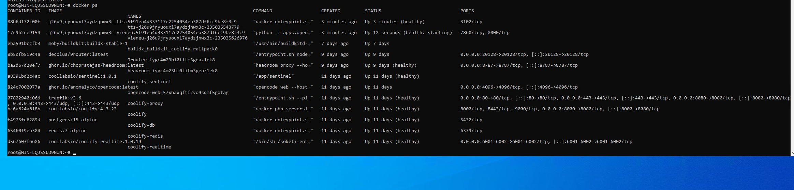

`vieneu` cần thêm vài phút sau khi khởi động để tải mô hình từ Hugging Face (lần đầu), nên có thể ở trạng thái `health: starting` một lúc.

### 9.2. Kiểm tra health API

```bash
curl -s https://tts.vtcdigital.top/api/health
# {"status":"ok","uptime":303}
```

Hoặc kiểm tra ngay trên máy chủ, đi qua Traefik:

```bash
curl -s -H 'Host: tts.vtcdigital.top' http://localhost:80/api/health
```

### 9.3. Giao diện web

Mở `https://tts.vtcdigital.top`. Khi `INTERNAL_BASIC_AUTH` có hiệu lực, trình duyệt hỏi tên đăng nhập/mật khẩu (nên thử bằng cửa sổ ẩn danh). Giao diện TTS Studio hiển thị; mục VN chọn giọng Edge (HoaiMy) đọc thử ngay được. Banner vàng "Giọng offline VieNeu chưa sẵn sàng - đang dùng giọng Edge" xuất hiện khi `vieneu` chưa lên; sau khi `vieneu` healthy, bấm **Thử lại** hoặc F5 thì banner mất và có thêm 25 giọng VieNeu.

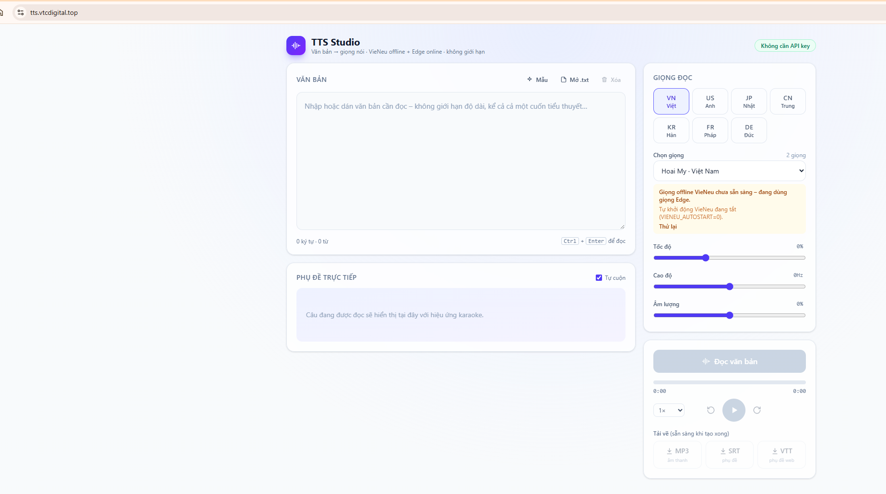

### 9.4. Theo dõi tài nguyên

```bash
top -bn1 | head -15
free -h
```

Trong lúc build, RAM còn trống ~6,8 GB, swap gần như không dùng, tiến trình `unpigz` cho thấy Docker đang giải nén layer image.

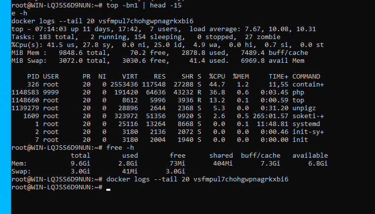

### 9.5. Log VieNeu khi thành công

```bash
docker logs --tail 30 vieneu-j26u9jryuouxl7aydzjnwx3c-<hậu-tố>
```

```
INFO Vieneu.V3Turbo: VieNeu-TTS v3 Turbo ready (backend=onnx)
INFO Vieneu.V3Turbo: Loaded 25 preset voices (default: Hải Đăng)
INFO vieneu.api: ready in 68.6s: backend=onnx max_streams=1 queue=1
INFO:     Application startup complete.
INFO:     Uvicorn running on http://0.0.0.0:8000
```

---

## 10. Lỗi đã gặp và cách khắc phục

Bảng tóm tắt, chi tiết từng lỗi ở các mục sau.

| # | Hiện tượng | Nguyên nhân | Cách sửa |
|---|---|---|---|
| 1 | Form tạo repo mặc định Railpack, Port 3000 | Coolify mặc định build pack tự dò | Đổi Build pack thành Docker Compose |
| 2 | Ô Docker compose content trống, "Load a Compose file to deploy" | Chưa nạp file compose | Bấm Reload Compose File |
| 3 | Tunnel trỏ `localhost:8102`/`3102` sẽ lỗi 502/1033 | Compose chỉ `expose` cổng 3102, không publish ra host | Service URL `http://localhost:80` + domain trong Coolify (cổng 3102, giao thức http) |
| 4 | Coolify tự thêm `www.tts...` | Hành vi mặc định | Xóa dòng đó (tùy chọn) |
| 5 | Log deploy đứng yên hàng chục phút | Coolify không stream output build | Kiểm tra bằng `docker ps`, `top`, `ps` |
| 6 | Container `cx7ug1j3erk9...` restart liên tục | Ứng dụng khác thiếu `DASHBOARD_BEARER_TOKENS` | Đặt biến hoặc Stop (không liên quan TTS) |
| 7 | `vieneu` ở trạng thái Restarting, exit code 3 | Volume cache Hugging Face thuộc root, user `app` không ghi được | `chown 1000:1000` volume rồi restart |
| 8 | `curl` trong PowerShell lỗi `-X`, `Port number was not a decimal` | PowerShell: `curl` là alias, `\` không escape | Dùng `curl.exe` với file JSON hoặc `Invoke-RestMethod` |

### 10.1. Build pack sai (Railpack, Port 3000)

**Hiện tượng:** form tạo resource hiện Build pack Railpack, Port 3000, Output type Web application (xem hình ở mục 5.2).

**Nguyên nhân:** Coolify tự đoán cách build; dự án Next.js này cần chạy qua `docker-compose.coolify.yml` với 2 service.

**Cách sửa:** đổi Build pack thành **Docker Compose**, đặt Compose file `/docker-compose.coolify.yml`.

### 10.2. Chưa nạp file compose

**Hiện tượng:** vào trang cấu hình thấy ô *Docker compose content (raw)* trống, góc trên báo "Load a Compose file to deploy"; mục Domain không liệt kê được service.

**Cách sửa:** bấm **Reload Compose File**; kiểm tra *Docker compose location* đúng `/docker-compose.coolify.yml`, đã `git push`.

### 10.3. Cấu hình Tunnel sai cổng (nguy cơ 502/1033)

**Hiện tượng:** route `tts.vtcdigital.top` ban đầu để `http://localhost:8102`; khi thử đổi sang `localhost:3102` cũng không có gì lắng nghe.

**Nguyên nhân:** các route khác của máy chủ dùng cổng host riêng (8000, 4096, 20128...). Với ứng dụng này compose không publish cổng ra host.

**Cách sửa:** Service URL = `http://localhost:80` (Traefik). Trong Coolify thêm domain `tts.vtcdigital.top` giao thức `http`, cổng `3102`. Xác nhận Traefik nghe cổng 80 bằng `docker ps` (hình ở mục 9.1 hoặc lệnh ở mục 2).

### 10.4. Domain `www.` tự sinh

Xóa dòng `http://www.tts.vtcdigital.top` bằng biểu tượng thùng rác. Nếu Coolify tự thêm lại, để nguyên, không ảnh hưởng hoạt động.

### 10.5. Log deploy đứng yên khi build

**Hiện tượng:** log dừng ở "Adding build arguments to Docker Compose build command" trên 14 phút.

**Chẩn đoán:** trong WSL:

```bash
docker ps -a --format '{{.Names}}\t{{.Status}}'
top -bn1 | head -15
free -h
```

- Container helper tên trùng ID deployment (`vsfmpul7chohgwpnagrkxbi6`, Up 21 phút) cho thấy deployment **vẫn chạy**.
- `unpigz` ăn CPU nghĩa là đang giải nén layer image.
- RAM `available` còn ~6,8 GB, không dấu hiệu OOM.

**Cách xử lý:** chờ (tổng cộng ~24 phút). Chỉ **Cancel Deployment** rồi Deploy lại khi quá ~30 phút mà không còn tiến trình build. Nếu log hiện `Killed` hoặc exit code 137 là hết RAM, xem mục 10.9.

### 10.6. Ứng dụng khác crash-loop (không thuộc dự án TTS)

**Hiện tượng:** `docker ps` thấy container `cx7ug1j3erk9...` (cổng 3000) có ID đổi liên tục, trạng thái `Restarting`.

**Chẩn đoán:**

```bash
docker logs --tail 40 $(docker ps -aq --filter name=cx7ug1j3erk9 | head -1)
docker inspect $(docker ps -aq --filter name=cx7ug1j3erk9 | head -1) --format '{{.HostConfig.RestartPolicy.Name}} {{.RestartCount}}'
```

Log báo `dashboard-backend fatal ... DASHBOARD_BEARER_TOKENS trống hoặc chưa set`, `RestartCount` 10260 (`unless-stopped`).

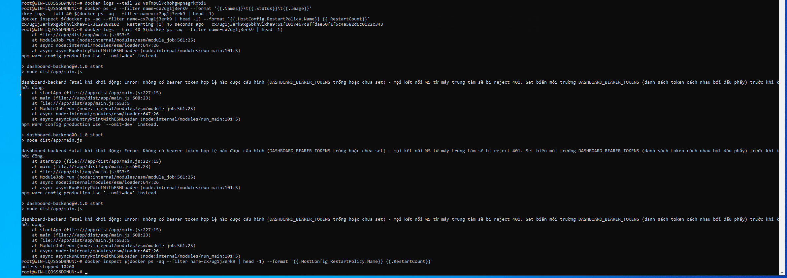

**Cách sửa:** trong Coolify, resource đó → Environment Variables → đặt `DASHBOARD_BEARER_TOKENS` rồi Redeploy; hoặc **Stop** nếu chưa dùng. Ứng dụng này tranh CPU/BuildKit nên nên xử lý, nhưng không phải nguyên nhân lỗi của TTS.

### 10.7. `vieneu` restart liên tục: PermissionError (lỗi quan trọng nhất)

**Hiện tượng:** web chạy bình thường nhưng banner vàng báo VieNeu chưa sẵn sàng; `docker ps` thấy:

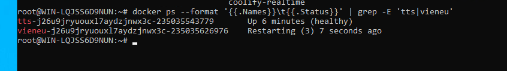

**Chẩn đoán:**

```bash
docker logs --tail 60 vieneu-j26u9jryuouxl7aydzjnwx3c-<hậu-tố>
docker inspect vieneu-j26u9jryuouxl7aydzjnwx3c-<hậu-tố> --format '{{.State.ExitCode}} {{.State.OOMKilled}}'
```

Kết quả: exit code `3`, `OOMKilled false`, và dòng lỗi cuối:

```
PermissionError: [Errno 13] Permission denied: '/home/app/.cache/huggingface/hub'
ERROR:    Application startup failed. Exiting.
```

**Nguyên nhân:** volume `vieneu-hf-cache` mới tạo thuộc sở hữu `root`, trong khi tiến trình VieNeu chạy bằng user `app` (uid:gid 1000:1000) nên không tạo được thư mục cache để tải mô hình. (Không phải lỗi RAM hay CPU.)

**Cách sửa** (làm một lần; volume được giữ qua các lần redeploy). Chạy trong WSL:

```bash
V=j26u9jryuouxl7aydzjnwx3c_vieneu-hf-cache
C=vieneu-j26u9jryuouxl7aydzjnwx3c-<hậu-tố>
IMG=$(docker inspect $C --format '{{.Config.Image}}')

# lấy uid:gid của user app trong image (kết quả thực tế: 1000:1000)
IDS=$(docker run --rm --entrypoint sh $IMG -c 'echo $(id -u app):$(id -g app)')
echo $IDS

# đổi chủ sở hữu volume rồi khởi động lại
docker run --rm -v $V:/d alpine chown -R $IDS /d
docker restart $C

# theo dõi log tải mô hình
docker logs -f --tail 30 $C
```

**Kết quả sau sửa:** VieNeu tải mô hình (khoảng 68,6 giây), nạp 25 giọng, `/health` trả 200 và container `(healthy)` (mục 9.5).

> Lỗi sẽ lặp lại nếu dựng volume mới trên máy chủ khác. Cách bền vững hơn là sửa `docker-compose.coolify.yml` (thêm service khởi tạo chạy `chown`, hoặc chạy `vieneu` với `user: root`).

### 10.8. PowerShell: gọi API bằng curl

**Hiện tượng 1:**

```
Invoke-WebRequest : A parameter cannot be found that matches parameter name 'X'.
```

Trong PowerShell 5.1, `curl` là alias của `Invoke-WebRequest`; `\` không phải ký tự nối dòng.

**Hiện tượng 2:** dùng `curl.exe` nhưng viết `--data "{\"text\":...}"` thì báo `curl: (3) URL rejected: Port number was not a decimal number`. Trong PowerShell ký tự escape là dấu backtick `` ` ``, không phải `\`, nên chuỗi JSON bị cắt thành nhiều đối số.

**Cách đúng:** ghi body ra file rồi gửi bằng `--data-binary`:

```powershell
Set-Content -Path body.json -Encoding utf8 -Value '{"text":"Xin chào, chúc bạn một ngày tốt lành.","voice":"vi-VN-HoaiMyNeural"}'

curl.exe -X POST "https://tts.vtcdigital.top/api/v1/tts" -H "Authorization: Bearer tts_<api-key>" -H "Content-Type: application/json" --data-binary "@body.json" -o test.mp3
```

Hoặc dùng `Invoke-RestMethod`:

```powershell
$body = @{ text = "Xin chào"; voice = "vi-VN-HoaiMyNeural" } | ConvertTo-Json
Invoke-RestMethod -Method Post -Uri "https://tts.vtcdigital.top/api/v1/tts" `
  -Headers @{ Authorization = "Bearer tts_<api-key>" } `
  -ContentType "application/json; charset=utf-8" `
  -Body ([System.Text.Encoding]::UTF8.GetBytes($body)) -OutFile test.mp3
```

Nếu file `test.mp3` chỉ vài chục byte thì đó là **phản hồi lỗi JSON** chứ không phải âm thanh (ví dụ `invalid_key` khi dùng key giả `tts_xxxx`). Xem bằng `Get-Content test.mp3`.

### 10.9. Giới hạn của môi trường Windows + WSL2 (phòng ngừa)

- **RAM WSL2:** mặc định chỉ dùng khoảng 50% RAM vật lý. Nếu build bị `Killed`/exit 137, tạo `C:\Users\<user>\.wslconfig`:

  ```ini
  [wsl2]
  memory=9GB
  swap=4GB
  processors=6
  ```

  rồi chạy `wsl --shutdown` trong PowerShell và mở lại WSL (các deployment đang chạy bị ngắt). Lần triển khai này **không cần** vì RAM còn dư.
- **CPU cũ (Xeon E5-2640 v2, không AVX2/VNNI):** để `VIENEU_PRECISION` mặc định (`fp32`), không dùng `int8`. Trong thực tế ONNX của VieNeu vẫn chạy được; tốc độ tổng hợp giọng chậm hơn máy mới và `max_streams=1`.
- **Khởi động lại Windows:** WSL2 không tự chạy nếu chưa có phiên nào mở; cần Task Scheduler chạy `wsl -d <distro>` hoặc giữ một tiến trình WSL nền để Coolify/Docker/cloudflared tự lên.

### 10.10. Lỗi có thể gặp nhưng chưa xảy ra

| Triệu chứng | Hướng xử lý |
|---|---|
| Edge TTS trả HTTP 403 | Microsoft đổi phiên bản Chromium; tăng giá trị `EDGE_CHROMIUM_VERSION` trong biến môi trường |
| 502/1033 khi truy cập tên miền | Kiểm tra Service URL của tunnel là `http://localhost:80`, domain trong Coolify đúng cổng 3102, Traefik đang chạy |
| Trang vào thẳng, không hỏi mật khẩu | Biến `INTERNAL_BASIC_AUTH` chưa nạp; kiểm tra bằng cửa sổ ẩn danh, Redeploy để container nhận biến |
| `Illegal instruction` trong log `vieneu` | CPU thiếu tập lệnh mà thư viện yêu cầu; tắt service `vieneu`, chỉ dùng Edge TTS |

---

## 11. Vận hành sau triển khai

### 11.1. Đổi mật khẩu Basic Auth

Coolify → Environment Variables → dòng **Production** của `INTERNAL_BASIC_AUTH` → sửa Value → Update Variable → **Redeploy**. Nên đổi nếu mật khẩu từng xuất hiện trong ảnh chụp, tin nhắn hoặc tài liệu.

### 11.2. Cấp API key cho đối tác

Base URL cho đối tác: `https://tts.vtcdigital.top/api/v1`. Các endpoint chính:

| Mục đích | Endpoint |
|---|---|
| Tạo giọng nói (stream MP3) | `POST /api/v1/tts` |
| Danh sách giọng | `GET /api/v1/voices` |
| Giọng nhân bản | `POST/GET/DELETE /api/v1/custom-voices` |

Tạo client và key (chỉ hiện **một lần**) bằng script có sẵn trong container:

```bash
docker exec -it tts-j26u9jryuouxl7aydzjnwx3c-<hậu-tố> node scripts/clients.mjs add "<tên-đối-tác>"
docker exec -it tts-j26u9jryuouxl7aydzjnwx3c-<hậu-tố> node scripts/clients.mjs list
docker exec -it tts-j26u9jryuouxl7aydzjnwx3c-<hậu-tố> node scripts/clients.mjs usage
```

Các lệnh con khác: `rotate <id>` (đổi key), `disable|enable <id>`, `set <id> charsPerMonth=2000000 allowCloning=true`, `remove <id>`. Ứng dụng tự đọc lại file khi thay đổi, không cần restart. Gửi đối tác tài liệu `docs/API.md`.

Hạn mức mặc định: 5.000 ký tự/request, 1.000.000 ký tự/tháng, 20 request/phút, 1 request đồng thời, 10 giọng nhân bản.

> Qua Cloudflare gói miễn phí, một request bị cắt nếu không nhận byte phản hồi nào trong khoảng 100 giây. API stream MP3 ngay từ đầu nên thường ổn, nhưng nên dặn đối tác chia nhỏ văn bản dài.

### 11.3. Tự động deploy khi push

Repo Public không tự có webhook. Trong Coolify tab **Webhooks** lấy URL, thêm vào GitHub (Settings → Webhooks); hoặc dùng thẻ *Git Repository (with GitHub App)* ngay từ đầu.

### 11.4. Cập nhật phiên bản

1. Sửa mã, `git commit`, `git push`.
2. Coolify → **Deploy** (hoặc webhook tự chạy).
3. Dữ liệu trong các volume được giữ nguyên.

### 11.5. Sao lưu

| Volume | Nội dung | Mức quan trọng |
|---|---|---|
| `tts-clients` | Danh sách đối tác, hash API key | Cao |
| `tts-usage` | Bản ghi sử dụng để tính phí | Cao |
| `tts-voices` | Giọng nhân bản | Cao |
| `tts-cache` | Cache âm thanh | Thấp (tái tạo được) |
| `vieneu-hf-cache` | Mô hình VieNeu | Thấp (tải lại được) |

---

## 12. Phụ lục

### 12.1. Lệnh chẩn đoán thường dùng (chạy trong WSL của máy chủ)

```bash
docker ps --format '{{.Names}}\t{{.Status}}'                  # trạng thái container
docker logs --tail 60 <tên-container>                          # log
docker logs -f --tail 30 <tên-container>                       # theo dõi log
docker inspect <tên> --format '{{.State.ExitCode}} {{.State.OOMKilled}}'
docker restart <tên-container>
free -h ; top -bn1 | head -15                                  # RAM/CPU
docker exec -it <tên-container-tts> node scripts/clients.mjs list
```

### 12.2. Biến môi trường

| Biến | Mặc định | Ý nghĩa |
|---|---|---|
| `INTERNAL_BASIC_AUTH` | rỗng | `user:password` khóa giao diện web (bắt buộc đặt khi công khai) |
| `VIENEU_API_KEY` | rỗng | Khóa dùng chung `tts` ↔ `vieneu` |
| `TTS_CONCURRENCY` | 3 | Số chunk tổng hợp song song mỗi request |
| `TTS_MAX_TEXT_LENGTH` | 2000000 | Giới hạn ký tự đầu vào (giao diện web) |
| `CACHE_MEMORY_MB` / `CACHE_DISK_MAX_MB` | 128 / 2048 | Bộ nhớ đệm trong RAM / trên đĩa |
| `V1_MAX_CONCURRENT` | 2 | Số request API đang tổng hợp cùng lúc |
| `VIENEU_CONCURRENCY` | 2 | Số request song song tới VieNeu (nên giảm về 1 trên CPU yếu) |
| `VIENEU_PRECISION` | fp32 | `int8` chỉ nên dùng khi CPU có VNNI |
| `EDGE_CHROMIUM_VERSION` | trong `.env.example` | Tăng khi Edge TTS trả 403 |

### 12.3. Danh sách kiểm tra khi triển khai lại

- [ ] Mã nguồn đã `git push`, repo thấy `docker-compose.coolify.yml`
- [ ] Cloudflare: route `tts` → `http://localhost:80`, DNS Proxied
- [ ] Coolify: Build pack Docker Compose, đã Reload Compose File
- [ ] Domain: service `tts`, `http`, cổng `3102`
- [ ] Biến `INTERNAL_BASIC_AUTH`, `VIENEU_API_KEY` ở dòng Production
- [ ] Deploy thành công, `tts` và `vieneu` đều `(healthy)`
- [ ] `/api/health` trả `{"status":"ok"}`
- [ ] Hỏi mật khẩu khi mở giao diện (cửa sổ ẩn danh)
- [ ] Giọng Edge và VieNeu đọc thử được
- [ ] Đã đổi mật khẩu tạm; đã tạo API key cho đối tác nếu cần
